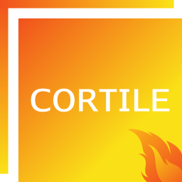
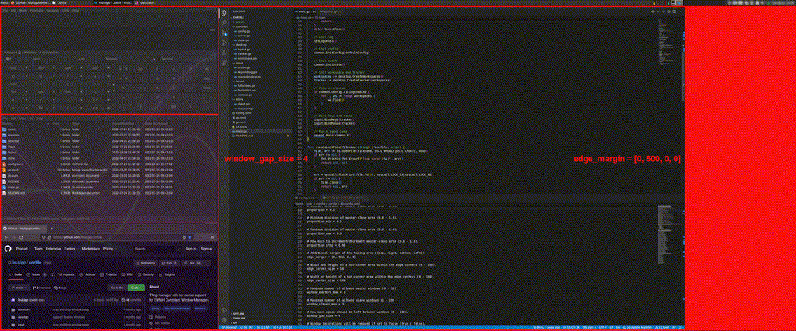

# Cortile


Tiling manager with _hot corner support_ for Xfce and other [EWMH Compliant Window Managers](https://en.wikipedia.org/wiki/Extended_Window_Manager_Hints).
Simply _keep your current window manager_ and **install [cortile](https://github.com/leukipp/cortile) on top** of it.
Once enabled, the tiling manager will _handle resizing and positioning_ of existing and new windows.

<br clear="left"/>

## Features [](#Features)
- [x] Workspace based tiling.
- [x] Keyboard and hot corner events.
- [x] Vertical, horizontal and fullscreen mode.
- [x] Persistent windows via "Always on Visible Workspace".
- [x] Floating windows via "Always on Top".
- [x] Resize of master-slave area.
- [x] Drag & drop window swap.
- [x] Auto detection of panels.
- [x] Selective tiling areas.
- [x] Multi monitor support.

Support for **keyboard and mouse navigation** sets cortile apart from other tiling solutions. The _go_ implementation ensures a fast and responsive system, where _multiple layouts_, _keyboard shortcuts_, _drag & drop_ and _hot corner_ events simplify and speed up your daily work.

[](https://github.com/leukipp/cortile)

## Install [](#Install)
You need [go >= 1.17](https://go.dev/dl/) to run cortile.

<details><summary>Install - go</summary><div>

### Option 1: Install go via package manager:
Use the `package manager` supported on your system:
```bash
# apt
sudo apt install golang

# yum
sudo yum install golang

# dnf
sudo dnf install golang

# pacman
sudo pacman -S go
```

### Option 2: Install go via archive download:
Download a `binary release` suitable for your system:
```bash
cd /tmp/ && wget https://dl.google.com/go/go1.17.linux-amd64.tar.gz
sudo tar -xvf go1.17.linux-amd64.tar.gz
sudo mv -fi go /usr/local
```

Set required environment variables:
```bash
echo "export PATH=$PATH:/usr/local/go/bin" >> ~/.profile
echo "export GOPATH=~/.go" >> ~/.profile
source ~/.profile
```

</div></details>

Verify the installed go version:
```bash
go env | grep "GOPATH\|GOVERSION"
```

<details><summary>Install - cortile</summary><div>

### Option 1: Install cortile using release files
Download [binary files](https://github.com/leukipp/cortile/releases) from `GitHub releases`:
```bash
# coming soon
```

### Option 2: Install cortile using remote source
Install `directly from GitHub` main branch:
```bash
go install github.com/leukipp/cortile@main
```

### Option 3: Install cortile using local source
Clone `source code from GitHub` main branch:
```bash
git clone https://github.com/leukipp/cortile.git -b main
cd cortile
```

If necessary you can make local changes, then execute:
```bash
go build && go install
```

</div></details>

Start cortile in verbose mode:
```bash
$GOPATH/bin/cortile -v
```

## Configuration [](#Configuration)
The configuration file resides under `~/.config/cortile/config.toml` and is created on the first launch using the default values.
Further information's about those values can be found in the comments of the [config.toml](https://github.com/leukipp/cortile/blob/main/config.toml) file.

[](https://github.com/leukipp/cortile)

### Shortcuts
It may be that some of the keyboard shortcuts are already used by your system. In that case, update the values under the `[keys]` section of the configuration file. 
| Keys                                                    | Description                              |
| ------------------------------------------------------- | ---------------------------------------- |
| <kbd>Ctrl</kbd>+<kbd>Shift</kbd>+<kbd>T</kbd>           | Tile current workspace                   |
| <kbd>Ctrl</kbd>+<kbd>Shift</kbd>+<kbd>U</kbd>           | Untile current workspace                 |
| <kbd>Ctrl</kbd>+<kbd>Shift</kbd>+<kbd>C</kbd>           | Cycle through layouts                    |
| <kbd>Ctrl</kbd>+<kbd>Shift</kbd>+<kbd>Space</kbd>       | Activate fullscreen layout               |
| <kbd>Ctrl</kbd>+<kbd>Shift</kbd>+<kbd>Left</kbd>        | Activate vertical-left layout            |
| <kbd>Ctrl</kbd>+<kbd>Shift</kbd>+<kbd>Right</kbd>       | Activate vertical-right layout           |
| <kbd>Ctrl</kbd>+<kbd>Shift</kbd>+<kbd>Top</kbd>         | Activate horizontal-top layout           |
| <kbd>Ctrl</kbd>+<kbd>Shift</kbd>+<kbd>Bottom</kbd>      | Activate horizontal-bottom layout        |
| <kbd>Ctrl</kbd>+<kbd>Shift</kbd>+<kbd>M</kbd>           | Make the active window master            |
| <kbd>Ctrl</kbd>+<kbd>Shift</kbd>+<kbd>Plus</kbd>        | Increase number of master windows        |
| <kbd>Ctrl</kbd>+<kbd>Shift</kbd>+<kbd>Minus</kbd>       | Decrease number of master windows        |
| <kbd>Ctrl</kbd>+<kbd>Shift</kbd>+<kbd>KP_Add</kbd>      | Increase number of maximum slave windows |
| <kbd>Ctrl</kbd>+<kbd>Shift</kbd>+<kbd>KP_Subtract</kbd> | Decrease number of maximum slave windows |
| <kbd>Ctrl</kbd>+<kbd>Shift</kbd>+<kbd>KP_6</kbd>        | Increase proportion of master-slave area |
| <kbd>Ctrl</kbd>+<kbd>Shift</kbd>+<kbd>KP_4</kbd>        | Decrease proportion of master-slave area |
| <kbd>Ctrl</kbd>+<kbd>Shift</kbd>+<kbd>KP_2</kbd>        | Focus next window                        |
| <kbd>Ctrl</kbd>+<kbd>Shift</kbd>+<kbd>KP_8</kbd>        | Focus previous window                    |

Hot corner events are defined under the `[corners]` section and will be triggered when the mouse enters one of the target areas:
| Corners                             | Description                              |
| ----------------------------------- | ---------------------------------------- |
| <kbd>Top</kbd>-<kbd>Left</kbd>      | Cycle through layouts                    |
| <kbd>Top</kbd>-<kbd>Center</kbd>    | Tile current workspace                   |
| <kbd>Top</kbd>-<kbd>Right</kbd>     | Make the active window master            |
| <kbd>Center</kbd>-<kbd>Right</kbd>  | Increase proportion of master-slave area |
| <kbd>Bottom</kbd>-<kbd>Right</kbd>  | Increase number of master windows        |
| <kbd>Bottom</kbd>-<kbd>Center</kbd> | Untile current workspace                 |
| <kbd>Bottom</kbd>-<kbd>Left</kbd>   | Decrease number of master windows        |
| <kbd>Center</kbd>-<kbd>Left</kbd>   | Decrease proportion of master-slave area |

Other useful shortcuts on Xfce environments:
- Move window: <kbd>Alt</kbd>+<kbd>Left-Click</kbd>.
- Resize window: <kbd>Alt</kbd>+<kbd>Right-Click</kbd>.
- Maximize window: <kbd>Alt</kbd>+<kbd>Double-Click</kbd>.

## Additional [](#Additional)
Additional features of cortile:
- Use the `edge_margin` property to account for additional spaces.
  - e.g. panels (deskbar), desktop infographics (conky).
- Use the `edge_margin` property to enable tiling only for parts of the monitor. 
  - e.g. use a left/right margin that is half the resolution of a large display to tile only windows that are moved inside a certain area. 
- Use the `window_slaves_max` property to limit the number of windows.
  - e.g. with one active master and `window_slaves_max = 2` the fourth and the following windows are stacked (behind the two slaves).
- Use the hot `[corners]` properties to execute any external command.
  - e.g. use `bottom_center = "firefox"` to open a browser window.

Companion tools for cortile:
- Simply add `cortile` to your startup applications to run it after login.
- You can install some [minimal-gtk](https://www.xfce-look.org/p/1016504) theme and leave `window_decoration = true`.

## Known Issues [](#Known_Issues)
Known issues and limitations of cortile:
- Huge gaps around GTK apps ([#3](https://github.com/leukipp/cortile/issues/3)).
- Only the biggest monitor is used for tiling.
- Persistent window resize only for the master-slave proportion.

If you encounter problems start the process with `cortile -vv`, which provides additional verbose outputs. Per default, a log file is created at `/tmp/cortile.log`.

## Credits [](#Credits)
Based on [zentile](https://github.com/blrsn/zentile) from [Berin Larson](https://github.com/blrsn).

## License [](#License)
[MIT](https://github.com/leukipp/cortile/blob/main/LICENSE)
